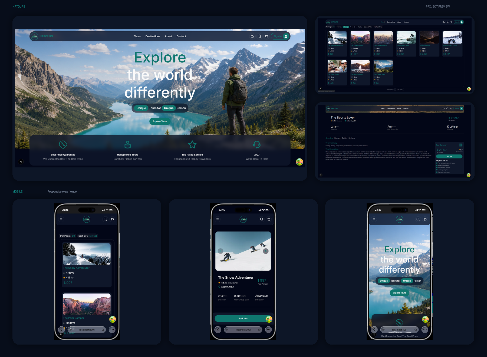

# 🌿 Natours

A modern travel and tour platform frontend built with **Next.js, React, TypeScript, and Tailwind CSS**.

Natours allows users to explore tours, search and filter available trips, view tour details and reviews, authenticate securely, and manage selected tours through a persistent shopping cart.

The frontend communicates with a separate RESTful backend for authentication, tours, reviews, and other application data.

---

## 📸 Preview



## ✨ Features

### 🔐 Authentication

- User registration and login
- JWT-based authentication
- HTTP-only cookie authentication
- Get current authenticated user
- Logout
- Forgot password flow
- Password reset
- Password validation
- Role-based authorization foundation

### 🗺️ Tours

- Browse available tours
- Tour details page
- Search tours
- Sort tours
- Pagination
- URL-based query parameters
- Dynamic tour pages
- Tour difficulty, duration, price, and ratings
- Featured tours

### ⭐ Reviews

- Display tour reviews
- Review pagination
- Infinite scrolling with TanStack Query

### 🛒 Shopping Cart

- Add tours to cart
- Remove tours from cart
- Increase/decrease number of travelers
- Automatic total price calculation
- Persistent cart using Zustand
- Cart state persists after page refresh

### 🔎 Search & Filtering

- Search tours by name
- Sorting
- Pagination
- URL query parameter management
- Search state synchronization with the URL

### 🎨 UI & UX

- Responsive design
- Dark mode
- Loading states
- Error states
- Empty states
- Custom animations and page transitions
- Reusable UI components
- Responsive navigation
- Mobile-friendly layouts

---

## 🧰 Tech Stack

### Frontend

- **Next.js 15**
- **React 19**
- **TypeScript**
- **Tailwind CSS**
- **TanStack Query**
- **Zustand**
- **Axios**
- **React Hook Form**
- **Zod**
- **Swiper**
- **next-themes**
- **Motion**
- **shadcn/ui / Base UI**
- **Iconify**

---

## 🏗️ Architecture

The project follows a modular component-based architecture using the **Next.js App Router**.

```text
app/
├── (routes)/
├── services/
├── layout.tsx
└── page.tsx

components/
├── ui/
├── tours/
├── cart/
├── navbar/
└── ...

hooks/
├── useTours
├── useReviews
├── useAuth
└── ...

lib/
├── API configuration
├── utilities
└── ...

providers/
├── React Query
├── State
└── Theme

public/
└── images/
```

The application separates UI components, API services, hooks, providers, and shared utilities to keep the codebase maintainable and scalable.

---

## ⚡ Data Fetching

The project uses **TanStack Query** for server-state management.

Implemented patterns include:

- `useQuery`
- `useInfiniteQuery`
- Query caching
- Query invalidation
- Server-side prefetching
- `HydrationBoundary`
- Query key management
- Loading and error states

The Tours page uses server-side query prefetching and hydrates the client with the prefetched data.

This approach helps reduce unnecessary client-side requests and provides a smoother initial page experience.

---

## 🔑 Authentication Flow

Authentication is handled using JWTs stored in **HTTP-only cookies**.

```text
User Login
    ↓
Backend validates credentials
    ↓
JWT generated
    ↓
JWT stored in HTTP-only cookie
    ↓
Browser automatically sends cookie
    ↓
Protected API request
    ↓
Backend verifies JWT
    ↓
Authenticated user
```

The frontend communicates with the backend using Axios with credentials enabled.

---

## 🔗 Backend

The backend is maintained in a separate repository.

The backend is responsible for:

- Authentication
- User management
- Tours
- Reviews
- Authorization
- Database operations
- RESTful API endpoints

**Backend Repository:**

https://github.com/Emir145813/Natours-Backend

---

## ⚙️ Getting Started

### 1. Clone the repository

```bash
git clone https://github.com/Emir145813/Natours.git
```

### 2. Navigate to the project

```bash
cd Natours
```

### 3. Install dependencies

```bash
npm install
```

### 4. Configure environment variables

Create a `.env` file in the project root:

```env
NEXT_PUBLIC_API_URL=your_backend_url
```

> Never commit your `.env` file to the repository.

### 5. Run the development server

```bash
npm run dev
```

Open:

```text
http://localhost:3001
```

---

## 🧪 Available Scripts

### Development

```bash
npm run dev
```

Start the development server.

### Production Build

```bash
npm run build
```

Create a production build.

### Production Server

```bash
npm run start
```

Start the production server.

### Lint

```bash
npm run lint
```

Run ESLint.

---

## 🚧 Current Status

The project is currently under active development.

### Completed

- [x] Authentication
- [x] JWT authentication with HTTP-only cookies
- [x] Password reset flow
- [x] Tours listing
- [x] Tour details
- [x] Search
- [x] Sorting
- [x] Pagination
- [x] Reviews
- [x] Infinite scrolling
- [x] Shopping cart
- [x] Persistent cart
- [x] Dark mode
- [x] Responsive UI
- [x] Loading and error states

### In Progress

- [ ] Admin dashboard
- [ ] Tour guide dashboard
- [ ] Booking system
- [ ] Payment integration
- [ ] File upload
- [ ] User profile management

---

## 🛣️ Future Updates

The following features are planned for future releases.

### Booking & Payments

- [ ] Tour booking system
- [ ] Booking history
- [ ] Booking management
- [ ] Payment integration
- [ ] Payment status handling

### Admin & Tour Guide

- [ ] Admin dashboard
- [ ] Tour guide dashboard
- [ ] Role-based dashboard access
- [ ] Tour management
- [ ] User management
- [ ] Booking management

### File Management

- [ ] User avatar upload
- [ ] Tour image upload
- [ ] Image management

### Notifications

- [ ] Booking confirmation emails
- [ ] Payment notifications
- [ ] Account-related notifications

### Testing & Documentation

- [ ] Unit tests
- [ ] Integration tests
- [ ] API documentation
- [ ] Swagger/OpenAPI integration

### Performance & Security

- [ ] Performance improvements
- [ ] Additional security improvements
- [ ] SEO improvements
- [ ] Core Web Vitals optimization

---

## 🎯 Project Goals

The main goals of Natours are:

- Build a realistic full-stack application
- Practice scalable React and Next.js architecture
- Work with server and client components
- Implement real-world authentication
- Practice server-state management with TanStack Query
- Practice global client-state management with Zustand
- Build a RESTful API
- Create a responsive and accessible user interface
- Improve frontend architecture and code quality

---

## 📌 Notes

Natours is a personal project created for learning, experimentation, and demonstrating full-stack web development skills.

The project is continuously evolving, and new features will be added over time.

---

## 👨‍💻 Author

**Emir**

Frontend / Full-Stack Developer
